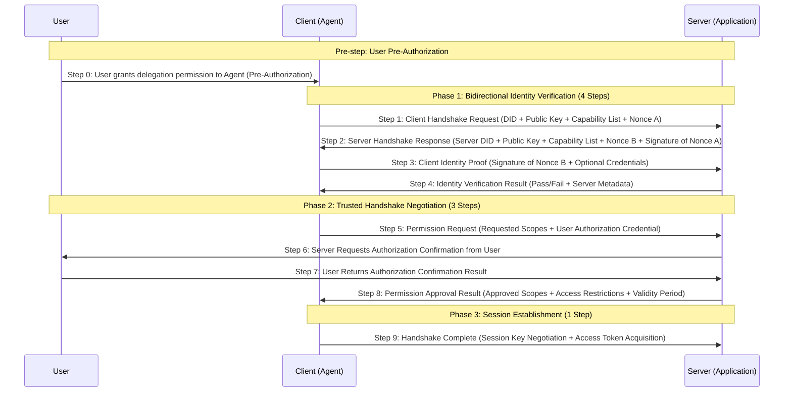

# Agent Trust Handshake (ATH) Protocol
> 🛡️ Making AI interactions as trustworthy, secure, and transparent as a human handshake
## 📋 Table of Contents
- [Project Overview](#project-overview)
- [What Problems Does It Solve?](#what-problems-does-it-solve)
- [Core Design Principles](#core-design-principles)
- [Protocol Workflow](#protocol-workflow)
- [Core Handshake Process](#core-handshake-process)
  - [9-Step Handshake Overview](#9-step-handshake-overview)
  - [Detailed Step Descriptions](#detailed-step-descriptions)
  - [Security Features](#security-features)
- [Application Scenarios](#application-scenarios)
- [Why Choose ATH?](#why-choose-ath)
- [Core Technical Specifications](#core-technical-specifications)
- [English Protocol Documentation](#english-protocol-documentation)
- [Deployment Modes](#deployment-modes)
- [Ecosystem Components](#ecosystem-components)
- [Quick Start](#quick-start)
- [Repository Directory Structure](#repository-directory-structure)
- [Core Handshake & Authorization Logic Location](#core-handshake--authorization-logic-location)
- [Developer Quick Navigation](#developer-quick-navigation)
- [Ecosystem Implementation Guide](#ecosystem-implementation-guide)
- [Open Source License](#open-source-license)
- [Contributing](#contributing)
---
## ATH Protocol — Trusted Agent Handshake Protocol Ecosystem
🛡️ Making AI interactions as trustworthy, secure, and transparent as a human handshake
## Project Introduction
- This protocol is jointly developed by the China Academy of Information and Communications Technology (CAICT), together with China Telecom Corporation Limited, China Mobile Jiutian Artificial Intelligence Technology (Beijing) Co., Ltd., The Chinese University of Hong Kong, Shenzhen, ZTE Corporation, and Tencent Technology (Beijing) Co., Ltd. The first version (V1.0) was released in April 2026.
- Project Contributors: Li Wei, Guo Xue, Ma Mingyang, Wei Bin, Sun Qiong, Song Xin, Wu Jing, Gao Hongmin, Zhong Ziyuan, Wu Baoyuan, Wang Changjin, Yang Shenglei, Meng Wei, Li Guancheng
## 🎯 Protocol Overview
ATH (Agent Trust Handshake) is the world's first open-source trusted interaction protocol standard specifically designed for AI agents, featuring **three-party participation and trusted handshake**.
Simply put, it is the "trusted access gatekeeper" of the AI world, perfectly solving the authorization problem when agents access services:
- ✅ **User Authorization**: Users are the owners of resources. All access to user resources must obtain explicit user consent.
- ✅ **Service Authorization**: Services are the providers of resources and have the right to decide whether to allow agents to access their services.
- ✅ **Trusted Handshake**: Only by obtaining a trusted handshake from both the user and the service can an agent successfully access resources.
- ✅ **Fully Traceable**: All interactions leave tamper-proof records, making responsibility clear when issues arise.
Building upon the traditional OAuth 2.0 authorization protocol, ATH innovatively introduces an "independent user role" and a "bidirectional trusted handshake" mechanism, fundamentally solving the trust problem in AI interactions.
---
## ❓ What Problems Does It Solve?
In today's era of explosive AI growth, we face an unprecedented trust crisis:
| Pain Point | ATH's Solution |
|---------|-------------|
| 🤖 Two AI systems don't know each other and hesitate to interact | Unified identity authentication system; every AI has a trusted identity |
| 🔍 AI accesses user data without clear authorization, making accountability unclear | Bidirectional handshake mechanism; every access requires explicit consent from both user and service |
| 🚫 Malicious AIs disguise as legitimate systems to steal data | Encrypted identity verification; identities cannot be forged |
| 📝 Interactions lack records, making dispute resolution impossible | All operations have tamper-proof evidence records |
| 🔌 Different vendors use non-unified AI standards, preventing interoperability | Unified protocol standard; any ATH-compliant system can seamlessly connect |
A real-life analogy:
Previously, AI interactions were like strangers casually entering your home, taking things without security checks, registration, or your knowledge.
With ATH, it's like a residential building with a secure access control system:
1. Visitors (AIs) must show ID (Trusted Identity)
2. Homeowner (User) confirms and grants entry
3. Property Management (Server) verifies visitor permissions
4. Entry time, locations visited, and actions taken are all logged
5. Exit registration is required upon leaving
The entire process is secure, transparent, and fully traceable.
---
## 💡 Core Design Principles
ATH is built around five core principles:
### 1. "User Sovereignty" Principle
> Users are the absolute owners of resources and hold final decision-making power.
- All access to user resources must obtain explicit user authorization.
- Users can grant, modify, or revoke authorization at any time.
- User authorization intent supersedes everything; no institution or individual can override it.
### 2. "Three-Party Participation" Principle
> Complete interactions involve three independent roles: User, Agent, and Service.
- User: Resource owner and authorization decision-maker.
- Agent: User's executor, representing the user to access services.
- Service: Resource provider and service decision-maker.
- Clear responsibilities, defined boundaries, and non-interference among parties.
### 3. "Trusted Handshake" Principle
> Agents must obtain trusted handshakes from both the user and the service to access resources.
- User Authorization: User agrees the agent can access specified resources on their behalf.
- Service Authorization: Service agrees to allow the agent to access its provided services.
- Both are mandatory; access cannot be completed if either party withholds authorization.
### 4. "Decentralization" Principle
> Does not rely on any centralized authority; supports any agent connecting to any service.
- Identity verification is based on asymmetric encryption algorithms, requiring no central authority.
- Authorization decisions are made autonomously by users and services, without third-party authorization bodies.
- Supports cross-platform, cross-ecosystem free interconnection with no single point of failure.
### 5. "Least Privilege" Principle
> Grants agents only the exact permissions needed for the current task, revoking them afterward.
- Each request grants only the minimum permissions required for the task.
- Permissions are time-bound and automatically expire.
- Supports fine-grained permission control, down to specific APIs or data records.
### 6. "Full Traceability" Principle
> All operations are logged; issues can be thoroughly investigated.
- Every handshake, access, and authorization has encrypted evidence.
- Records are tamper-proof and undeletable.
- Supports auditing and tracing for troubleshooting and dispute resolution.
---
# Handshake Process
The core of the ATH protocol is a 9-step trusted handshake process involving three parties: **Agent (Client)**, **Application (Server)**, and **User**. It implements a "User + Service" trusted handshake mechanism without any centralization.
## 9-Step Handshake Overview

## Core Design Concept: Three-Party Participation, Trusted Handshake
The ATH protocol is a three-party protocol. A complete trusted handshake requires the joint participation of three roles:
| Role | Responsibility | Core Rights |
|------|------|----------|
| **User** | Resource Owner | Final decision-making power; all access to user resources requires explicit user consent |
| **Agent (Client)** | User's Executor | Represents the user to access services and execute specific tasks |
| **Application (Server)** | Resource Provider | Decides whether to allow agent access to its services |
> ✅ **Trusted Handshake Mechanism**: For an agent to successfully access a service, it must obtain two authorizations simultaneously, neither of which can be missing:
> 1. **User-Side Permission**: User agrees the agent can access specified resources on their behalf.
> 2. **Service-Side Permission**: Server agrees to allow the agent to access its provided services.
## Detailed Step Descriptions
### Pre-step: User Pre-Authorization
#### Step 0: User Grants Delegation Permission to Agent
Before using an agent, the user pre-grants delegation permissions, clearly defining the scope in which the agent can act on their behalf:
- User signs an authorization credential specifying resource scope, validity period, and operational restrictions.
- Agent obtains the user authorization credential as proof of user consent for subsequent service access.
- Pre-authorization can be one-time, short-term, or long-term. Users can revoke it at any time.
### Phase 1: Bidirectional Identity Verification (4 Steps)
#### Step 1: Client Identity Announcement
The agent (client) initiates a connection request to the server, announcing its identity information:
- **Client DID**: Decentralized Identifier, uniquely identifying the agent.
- **Client Public Key**: Public key for identity verification.
- **Supported Protocol Versions**: List of ATH protocol versions supported by the client.
- **Client Capability Set**: Supported encryption algorithms, signature algorithms, etc.
- **Nonce A**: Random challenge string generated by the client to prevent replay attacks.
#### Step 2: Server Identity Response
The server returns its identity information, completing the initial verification of the client:
- **Server DID**: Server's decentralized identifier.
- **Server Public Key**: Public key for identity verification.
- **Negotiated Protocol Version**: Highest protocol version supported by both parties.
- **Server Capability Set**: Supported encryption algorithms, signature algorithms, etc.
- **Nonce B**: Random challenge string generated by the server.
- **Signature of Nonce A**: Server signs with its private key to prove identity legitimacy.
#### Step 3: Client Identity Proof
After verifying the server's identity, the client provides its own identity proof:
- **Signature of Nonce B**: Client signs with its private key to prove identity legitimacy.
- **Optional Identity Credentials**: May provide third-party issued credentials to enhance trustworthiness.
#### Step 4: Identity Verification Result
After verifying the client's signature, the server returns the verification result:
- **Verification Result**: Pass/Fail
- **Server Metadata**: Includes server endpoints, supported scope lists, token validity periods, etc.
- **Failure Reason**: Clear reason if verification fails.
### Phase 2: Trusted Handshake Negotiation (3 Steps)
#### Step 5: Scope Request
The agent requests access permissions from the server while submitting the user pre-authorization credential:
- **Requested Permission List**: Formatted as `resource:operation` (e.g., `user:read`, `data:write`)
- **Access Validity Period**: Requested validity period for the access credential.
- **User Authorization Credential**: Pre-signed user authorization credential proving user consent.
- **Request Context**: Optional business scenario description for authorization decision-making.
#### Step 6: Server Requests Authorization Confirmation from User
The server initiates an authorization confirmation request to the user to ensure the user's authorization is genuine and valid:
- Server sends an authorization confirmation request to the user, including agent identity and requested permission scopes.
#### Step 7: User Returns Authorization Confirmation Result
The user confirms the authorization request and returns the result:
- User can choose to approve, deny, or modify the authorization scope.
- The confirmation result is signed by the user and holds legal validity.
#### Step 8: Permission Approval Result
The server combines the user's authorization result with its own security policies to make the final approval:
- **Approved Scope List**: Final granted permission scope.
- **Denied Scopes & Reasons**: Denied permissions with clear explanations.
- **Access Restriction Conditions**: IP restrictions, rate limits, and other additional constraints.
- **Authorization Validity Period**: Final validity period for the granted access credential.
### Phase 3: Session Establishment (1 Step)
#### Step 9: Handshake Complete
Both parties complete key negotiation and establish an encrypted communication channel:
- Agent and server complete session key negotiation.
- Server issues a short-term access token to the agent.
- Both parties formally establish an end-to-end encrypted communication channel.
- Agent can now use the token to access service resources.
## Security Features
- **Three-Party Participation Mechanism**: User participates as an independent role with final decision-making power.
- **Trusted Handshake Mechanism**: Requires dual confirmation from both user and service; neither can be missing.
- **Fully Decentralized**: No central authority or authorization body required.
- **Bidirectional Identity Authentication**: Directly verifies identities via asymmetric encryption, preventing man-in-the-middle attacks.
- **Least Privilege Principle**: Grants only the minimum permissions necessary for the current task.
- **Short-Lived Credentials**: Access credentials have short validity periods, reducing leakage risks.
- **Non-Repudiation**: All interactions are digitally signed, auditable, and traceable.
---
## 🎯 Application Scenarios
ATH can be applied to almost any scenario requiring AI interactions:
### 1. 🤖 Multi-Agent Collaboration
Multiple AI agents from different vendors collaborate on complex tasks, interacting securely and trustworthily.
### 2. 🔒 Sensitive Data Processing
AI needs to access user privacy data (e.g., medical, financial). All access has explicit authorization and records.
### 3. 🌐 Cross-Platform Service Integration
AI services across different platforms can integrate using a unified standard without redundant adaptation layers.
### 4. 🏢 Enterprise AI Applications
Unified management of internal enterprise AI systems; all access is audited to meet compliance requirements.
### 5. 💰 AI Service Transactions
Buyers and sellers of AI services complete transactions via ATH protocol with automatic settlement and full traceability.
---
## ✨ Why Choose ATH?
| Comparison Item | Traditional Authorization | ATH Protocol |
|--------|-------------|--------|
| Trust Model | Unidirectional trust (only verifies client) | Bidirectional trust (client and server mutually verify) |
| Authorization Mechanism | One-time authorization, overly broad permissions | Least privilege, on-demand authorization, auto-expiry |
| Traceability | Incomplete logs, easily tampered | Fully encrypted evidence, tamper-proof |
| AI-Friendliness | Designed for humans, unsuitable for AI | Specifically designed for AI agents, fits AI interaction patterns |
| Interoperability | Non-unified standards across vendors | Unified standard; any compliant system can connect |
| Ease of Use | Complex integration, heavy development | Multi-language SDKs provided, 5-minute integration |
---
## 📜 Core Technical Specifications
### 1. Identity Authentication Specification
- Uses asymmetric encryption algorithms; each AI agent has a unique public/private key pair.
- Identity certificates contain AI basic info, public key, issuing authority, validity period, etc.
- Supports cross-platform, cross-institutional identity mutual recognition.
### 2. Handshake Protocol Specification
- Uses TLS 1.3 for encrypted transmission, preventing eavesdropping and tampering.
- Handshake messages follow a unified format specification, including identity info, permission requests, context info, etc.
- Supports multiple signature algorithms, compatible with different security levels.
### 3. Access Control Specification
- Supports Role-Based Access Control (RBAC).
- Supports fine-grained permission declarations, down to API level.
- Permission validity periods are configurable, supporting temporary and permanent permissions.
### 4. Evidence & Audit Specification
- All interaction records are stored using Merkle tree structures, making them tamper-proof.
- Supports encrypted evidence storage to protect user privacy.
- Provides standardized audit APIs for easy integration with third-party audit systems.
---
## 📚 English Protocol Documentation
For developers and non-technical users, we provide a fully annotated version of the protocol:
📄 [ATH Protocol Standard - Annotated Version](./specification/ath-protocol-annotated.md)
---
## 🚀 Deployment Modes
ATH supports two deployment modes, selectable based on actual needs:
### Mode 1: Gateway Mode (Recommended)
```
AI Agent → ATH Gateway → Backend Service
```
- **Features**: All requests pass through the ATH gateway for unified verification and processing.
- **Advantages**: Simple deployment; no need to modify existing service code.
- **Use Cases**: Enterprise applications, multi-service scenarios, scenarios requiring unified management.
### Mode 2: Native Mode
```
AI Agent ↔ ATH-Native Service
```
- **Features**: The service itself implements the ATH protocol and handshakes directly with the AI agent.
- **Advantages**: Higher performance, lower latency.
- **Use Cases**: High-performance requirements, lightweight applications, embedded devices.
---
## 🌐 Ecosystem Components
ATH is a complete ecosystem consisting of five core components:
| Component | Role | Target Audience |
|------|------|----------|
| [agent-trust-handshake-protocol](https://github.com/ath-protocol/agent-trust-handshake-protocol) | Core Protocol Standard (this repository) | Protocol researchers, standard setters, SDK developers |
| [typescript-sdk](https://github.com/ath-protocol/typescript-sdk) | TypeScript/JavaScript SDK | Frontend developers, Node.js developers |
| [python-sdk](https://github.com/ath-protocol/python-sdk) | Python SDK | AI developers, data scientists, backend developers |
| [athx](https://github.com/ath-protocol/athx) | ATH Core Engine, handles handshake & authentication logic | DevOps, Architects |
| [gateway](https://github.com/ath-protocol/gateway) | ATH Gateway Service, unified access entry point | DevOps, Architects |
---
## 📄 Open Source License
This project is licensed under the **OpenATH License**. You are free to use, modify, and distribute it. Please refer to the LICENSE file for specific terms.
## 🤝 Contributing
We welcome all developers interested in trusted AI to contribute! Whether improving protocol specifications, reporting bugs, writing documentation, or suggesting enhancements, your contributions make the ATH ecosystem better.
> 💡 ATH's Vision: Make every AI interaction trustworthy!
---
## 📁 Repository Directory Structure
This repository defines the ATH protocol standard and contains only protocol specifications and documentation. All concrete implementations are in separate repositories.
```
agent-trust-handshake-protocol/
├── 📄 Root Files
│   ├── README.md                   # Project documentation (this file)
│   ├── LICENSE                     # OpenATH License
│   ├── CODE_OF_CONDUCT.md          # Community participation guidelines
│   ├── CONTRIBUTING.md             # Protocol contribution guide
│   └── SECURITY.md                 # Security vulnerability reporting process
│
├── 📚 docs/                        # Official technical documentation
│   ├── getting-started/            # Quick start guide, 5-minute intro for beginners
│   ├── learn/                      # Deep dive into core concepts: architecture, workflows, security principles
│   ├── develop/                    # Development guide: how to implement the ATH protocol
│   └── tutorials/                  # Step-by-step tutorials: security best practices, audit configuration, etc.
│
├── 📝 example/                     # Real-world application examples
│   ├── shopping-scenario.mdx       # Complete e-commerce shopping scenario example
│   └── gateway-scenario.mdx        # Complete API gateway scenario example
│
├── 📜 specification/               # Core protocol specifications (most authoritative standard definitions)
│   ├── 0.1/                        # v0.1 protocol version
│   │   ├── basic/                  # Basic protocol specifications
│   │   │   ├── handshake-flow.mdx  # [CORE] Detailed definition of the 12-step trusted handshake process
│   │   │   └── handshake-flow.zh.mdx # Chinese version of the handshake flow specification
│   │   ├── client/                 # Client protocol specifications
│   │   │   ├── handshake-flow.mdx  # Client handshake flow implementation specification
│   │   │   └── reference-implementation.mdx # Client reference implementation
│   │   └── server/                 # Server protocol specifications
│   │       ├── handshake-flow.mdx  # Server handshake flow implementation specification
│   │       └── reference-implementation.mdx # Server reference implementation
│   └── ath-protocol-annotated.md # Annotated protocol version (easy to understand)
│
├── 🏗️ schema/                      # Machine-readable data structure definitions
│   └── 0.1/
│       ├── schema.json             # JSON Schema format, usable for code generation & parameter validation
│       └── meta.json               # Protocol metadata definitions
│
├── 🌐 zh/                          # Chinese documentation zone (100% synchronized with English)
│   ├── docs/                       # Chinese technical documentation
│   └── specification/              # Chinese protocol specifications
│
├── 🎨 logo/                        # Project logo assets (free to use)
└── 👥 community/                   # Community-related content
    ├── roadmap.mdx                 # Project development roadmap
    ├── comparison.mdx              # Comparison with OAuth, JWT, and other protocols
    ├── glossary.mdx                # Glossary of terms
    └── contributing.mdx            # Contributor guidelines
```
---
## 🎯 Core Handshake & Authorization Logic Location
All core protocol specifications are located in the `specification/` directory:
### 🔑 Core File Checklist
| File Path | Content Description | Importance |
|---------|----------|----------|
| 📄 `specification/0.1/client/handshake-flow.mdx` | **Most critical handshake flow specification**. Details the complete 12-step process from initiation to completion, including message formats, interaction logic, error handling, etc. | ⭐⭐⭐⭐⭐ |
| 📄 `specification/0.1/server/authorization.mdx` | **Authorization logic specification**. Defines permission verification, authorization decision-making, and least privilege implementation standards. | ⭐⭐⭐⭐⭐ |
| 📄 `specification/0.1/client/identity.mdx` | Identity authentication specification. Defines digital identity formats, generation methods, and verification logic for AI agents and services. | ⭐⭐⭐⭐ |
| 📄 `specification/0.1/server/token.mdx` | Token specification. Defines access token formats, generation algorithms, validity management, and verification methods. | ⭐⭐⭐⭐ |
| 📄 `specification/0.1/client/security.mdx` | Security specification. Defines encryption algorithms, signature algorithms, and anti-attack requirements. | ⭐⭐⭐⭐ |
| 📄 `spec/openapi.yaml` | OpenAPI interface definition. All protocol HTTP API formats are defined here; SDKs and server implementations must follow this standard. | ⭐⭐⭐⭐ |
| 📄 `schema/0.1/schema.json` | Data structure JSON Schema definition. Validation standard for all message formats. | ⭐⭐⭐ |
### 💡 Quick Lookup Tips
- To **implement protocol logic**: Start with `spec/openapi.yaml` and `schema/0.1/schema.json`. These are machine-readable specifications that can be directly parsed by code.
- To **understand protocol principles**: Start with `docs/learn/trusted-handshake.mdx` for illustrated explanations, then review the detailed specifications in `specification/`.
- For **Chinese users**: Directly refer to the `zh/` directory. Content is fully synchronized with the English version.
---
## 🏁 Quick Start
### If you are a regular user:
1. You now understand what ATH does!
2. To experience it, visit our [Online Demo](https://demo.ath-protocol.org) to try the handshake process.
3. Continue reading the technical content below if interested.
### If you are a protocol researcher:
1. Check the `specs/` directory in this repository for detailed protocol specifications.
2. Check the `examples/` directory for practical usage examples.
3. Submit Issues or PRs to participate in protocol improvement and discussion.
### If you are an application developer:
1. Choose the SDK for your language (TypeScript/Python).
2. Follow the SDK documentation to complete integration in 3 steps.
3. Your application now has trusted interaction capabilities.
### If you are a DevOps engineer:
1. Deploy the ATH core engine (athx) and gateway service (gateway).
2. Configure service and permission rules.
3. Connect your AI applications and backend services.
---
## 🚀 Developer Quick Navigation
| Role | Recommended Reading Order |
|------|--------------|
| 👨‍💻 SDK Developer | 1. `docs/getting-started/quickstart.mdx` → 2. `spec/openapi.yaml` → 3. `schema/0.1/schema.json` |
| 👷‍♂️ Server Developer | 1. `docs/develop/build-gateway.mdx` → 2. All files under `specification/0.1/server/` |
| 📝 Protocol Researcher | 1. `docs/learn/architecture.mdx` → 2. All files under `specification/0.1/client/` → 3. Community `roadmap.mdx` |
| 🎯 Business Developer | 1. `docs/getting-started/intro.mdx` → 2. `docs/examples/scenario.mdx` → 3. Corresponding language SDK documentation |
---
## 🌱 Ecosystem Implementation Guide
This repository only defines protocol standards. Concrete implementation code resides in separate repositories, which you can use directly as needed:
### 📦 Official Implementation Repositories
| Repository | Function | Target Audience | URL |
|------|------|----------|------|
| 🐍 [python-sdk](https://github.com/ath-protocol/python-sdk) | Python Language SDK | AI developers, backend engineers | Integrate ATH capabilities into Python applications & AI agents |
| 🔌 [typescript-sdk](https://github.com/ath-protocol/typescript-sdk) | TypeScript/JavaScript Language SDK | Frontend engineers, Node.js developers | Integrate ATH capabilities into web apps, mini-programs, Node.js apps |
| ⚡ [athx](https://github.com/ath-protocol/athx) | ATH Core Engine Implementation | DevOps engineers, architects | Core service handling handshakes, authentication, authorization, and token management |
| 🚪 [gateway](https://github.com/ath-protocol/gateway) | ATH Gateway Service Implementation | DevOps engineers, architects | Unified access entry point providing security protection, load balancing, and traffic control |
### 💡 Implementer Quick Guide
- To **develop an SDK**: Refer to `spec/openapi.yaml` and `schema/0.1/schema.json` in this repository and implement according to the interface standards.
- To **develop a gateway/server**: Refer to all specifications under `specification/0.1/server/`.
- To **develop an AI agent**: Directly use the corresponding language SDK. Integration takes just 5 minutes.